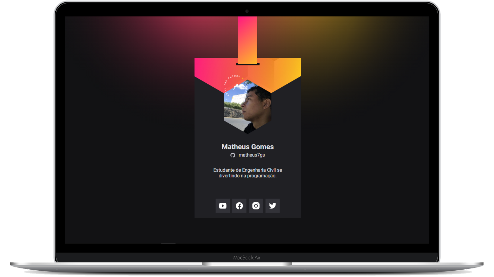

<h1 align="center">Crachá virtual - DoWhile 2021</h1>

  <a href="#-tecnologias">Tecnologias</a>&nbsp;&nbsp;&nbsp;|&nbsp;&nbsp;&nbsp;
  <a href="#-projeto">Projeto</a>&nbsp;&nbsp;&nbsp;|&nbsp;&nbsp;&nbsp;
  <a href="#-layout">Layout</a>&nbsp;&nbsp;&nbsp;|&nbsp;&nbsp;&nbsp;
  <a href="#-licença">Licença</a>

  
  

  

## 🚀 Tecnologias

Esse projeto foi desenvolvido com as seguintes tecnologias:

- JavaScript
- HTML
- CSS

## 💻 Projeto

O Crachá virtual DoWhile é uma aplicação com o objetivo de mostrar as informações do usuário trazidas da API GitHub.

## 🔖 Layout

Você pode visualizar o layout do projeto através [desse link](<https://www.figma.com/community/file/1031698737363668691/%5BNLW-Heat---Mission%3A-Origin%5D-DoWhile2021>). É necessário ter conta no [Figma](https://figma.com) para acessá-lo.

## 📄 Licença

Esse projeto está sob a licença MIT. Veja o arquivo [LICENSE](LICENSE) para mais detalhes.

---

Feito com ❤ by Matheus 👋🏻
